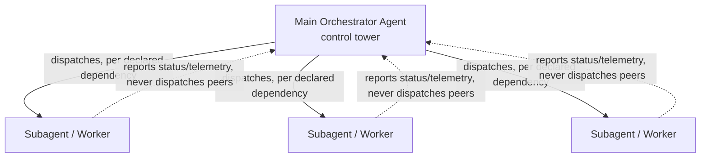
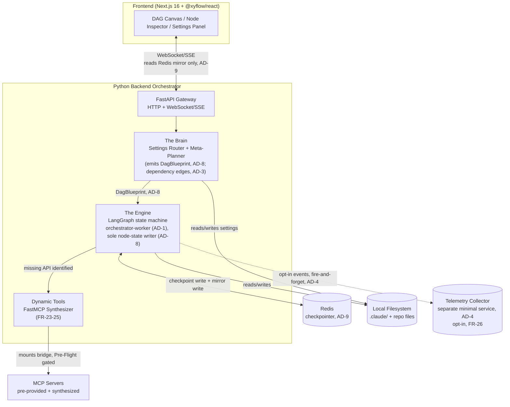

# Architecture Spine — Claude Wrapper

## Design Paradigm

**Orchestrator-worker (supervisor).** One main orchestrator agent ("control tower") owns the DAG blueprint and dispatch; every subagent ("flight") is an independently checkpointed worker with no peer-to-peer coordination. Maps directly onto the PRD's own vocabulary: the control tower files and sequences a flight plan, workers execute their assigned leg and report back — they never negotiate directly with each other.



## Invariants & Rules

### AD-1 — Orchestrator-worker paradigm

- **Binds:** all agent execution (FR-7 through FR-18, FR-23–FR-25)
- **Prevents:** subagents self-dispatching without the control tower's gate; workers holding shared mutable state instead of the supervisor owning it.
- **Rule:** the main orchestrator agent is the single owner of DAG dispatch and sequencing (FR-11). Every subagent is an independently checkpointed worker. No subagent-to-subagent direct coordination exists — all coordination routes through the orchestrator.

### AD-2 — Unified Node model; per-agent execution state is a rollup, not a record

- **Binds:** FR-8, FR-9, FR-13, FR-14, FR-16, FR-19, FR-20, the execution-node telemetry contract (PRD §10)
- **Prevents:** a split between "context node" and "execution node" as separate schemas/tables — the exact ambiguity the PRD's adversarial review caught and the Glossary had to disambiguate in prose — while also preventing the inverse mistake of literally storing one execution record per agent that duplicates what's already on its nodes.
- **Rule:** `Node` is one entity, not two types, no type discriminator, and it is the sole unit of storage. Every subtopic node in an agent's context graph carries both context-graph fields (topic, source reference, relations to its graph neighbors — assigned by the Meta-Planner at planning time) and execution fields (`status`, `telemetry`, `live_stream`, checkpoint reference) on the same record, pre-provisioned for *every* candidate node at planning time (not allocated lazily when the flight path reaches a node) so execution-time context/state access is fast. A node's own knowledge is scoped to its own context content and its graph neighbors — never global run state. PRD FR-13/FR-19's "one execution node per agent" is a **computed rollup view** aggregated from that agent's own nodes (e.g. aggregate status, summed tokens) — it is never separately stored, and nothing writes to it directly.

### AD-3 — Explicit declared dependencies, applied uniformly

- **Binds:** FR-7, FR-11
- **Prevents:** two builders disagreeing on whether subagent ordering comes from a declared plan or from runtime heuristics (e.g. watching for file/context overlap); and a re-introduction of the "new-project-only" misreading the source architecture doc's diagram could otherwise suggest.
- **Rule:** the Meta-Planner emits explicit dependency edges in the DAG blueprint (AD-8) at planning time (e.g. "subagent B depends on subagent A completing"). The Engine mechanically respects this declared ordering — it never infers dependency from runtime behavior. This applies uniformly to every run, existing repo or brand-new — it is not a new-project-only mechanism, regardless of how the source architecture doc's diagram could be read.

### AD-4 — Telemetry collection is a separate minimal service, non-blocking, schema-pinned

- **Binds:** FR-26
- **Prevents:** FR-26's opt-in analytics collector being read as (or growing into) the "cloud-hosted managed backend" the PRD explicitly defers to v3; `backend/telemetry/` and `telemetry-collector/` inventing incompatible event shapes since they have separate deploy lifecycles; and telemetry emission stalling the Engine's dispatch loop.
- **Rule:** telemetry collection runs as a small, separate, self-hosted service — never bundled into the local FastAPI orchestration backend, never routed through a third-party analytics provider. It is analytics-only and never executes agent work. Events use a single pinned Pydantic model (`TelemetryEvent`) shared by emitter and collector, with an explicit field allow-list: run/agent counts, per-agent completion/cancellation outcome, estimated-vs-actual token/time deltas (PRD FR-19/FR-22 values only). `live_stream.thinking`, file paths, file contents, and prompts are never included — allow-listed fields only, not a deny-list. Emission is fire-and-forget: non-blocking, a bounded timeout, no retry that can stall the Engine's dispatch loop.

### AD-5 — Node status enum includes `trouble`; single-writer, event-typed [extends PRD §10/OQ-2]

- **Binds:** FR-17, the execution-node telemetry contract, AD-8
- **Prevents:** the push-or-cancel flow (FR-17) having no schema state to key its UI off of; a worker and the orchestrator racing to write the same node's `status`; and FR-17's UI trigger silently never firing because frontend and backend disagree on which channel carries a `trouble` transition.
- **Rule:** the `status` enum on every node is `waiting_input | executing | trouble | completed | cancelled | failed`. `trouble` and `failed` are both system-detected non-`cancelled` outcomes — `trouble` is non-terminal (recoverable via push), `completed`/`cancelled`/`failed` are terminal. This extends the PRD Glossary's "exactly two terminal outcomes" (which describes the two *user-facing* terminal states — an agent the user experiences ending, one way or another); `failed` is the system-error case the Glossary prose didn't separately enumerate. Per AD-8, only the Engine writes `status` — a worker never writes its own or any node's status directly, including on entering trouble. A worker signals trouble by raising an interrupt to the orchestrator; the orchestrator performs the actual `status=trouble` write. `trouble` is delivered to the frontend as an ordinary node-status update on the telemetry stream (not the error envelope) — the error envelope is reserved for `failed`/terminal-adjacent conditions.

### AD-6 — No OS-level sandboxing beyond Permission Manager grants; process-liveness is in-memory by design [extends PRD §9]

- **Binds:** FR-16, FR-23, FR-24, FR-25
- **Prevents:** an implementer adding (or assuming the need for) OS-level process sandboxing that the PRD explicitly scoped out of v1; and a builder trying to persist process ownership into Redis, which would let a restarted backend mistakenly reassert control over a PID the OS has since reassigned to an unrelated process.
- **Rule:** spawned FastMCP processes — including synthesized bridges — get no additional OS-level sandboxing. "Isolated" means logically scoped to the requesting agent (a process is only ever accessed by the agent that spawned it), not OS-sandboxed. The Permission Manager's approve/revoke flow (FR-4/5/6) is the entire v1 trust boundary. Process-to-agent ownership is tracked **in-memory only, by design** — this is an explicit, named exception to the "no in-memory-only state" convention below, because a PID is not meaningfully checkpointable. On backend restart, every previously-spawned process is treated as dead; nothing is reasserted or re-adopted — any in-flight agent work is re-verified against its last durable checkpoint (AD-9) and re-spawned from there if still needed, satisfying the process-cleanup guarantee (PRD §8) across a crash, not just a user-initiated Stop & Undo.

### AD-7 — Flight-path selection is a constrained local search

- **Binds:** FR-9, FR-14, FR-20 (the product's stated core differentiator, PRD §4.3)
- **Prevents:** two builders independently inventing incompatible routing algorithms (e.g. one coverage-then-cheapest-path, another LLM-scored) with no shared cost function to validate against.
- **Rule:** flight-path selection is a constrained search over an agent's context graph, run in `backend/brain/meta_planner/`: (1) the path must cover the context nodes required for the agent's task — a hard coverage constraint; (2) cumulative token cost along the path must not exceed the agent's predicted token budget (FR-10) — a hard budget constraint, not a soft preference; (3) subject to (1) and (2), the search optimizes for token efficiency — preferring the direction of already-efficient token usage over fighting against it. The search operates over each node's local neighbor relations (per AD-2) — it does not require global lookahead beyond the graph the Meta-Planner already built at planning time.

### AD-8 — Pinned Brain→Engine handoff contract; Engine is sole node-state writer

- **Binds:** FR-7, FR-8, FR-9, FR-11, all of AD-1/AD-2/AD-3
- **Prevents:** two builders each writing valid code that never compiles together at the Brain→Engine seam — one assuming the Meta-Planner pre-writes node state into the checkpoint store, the other assuming the Engine is the sole writer; and a resulting double-write or missing-field crash.
- **Rule:** the Brain emits a `DagBlueprint` (Pydantic model, named and versioned alongside `SettingsRouterOutput`) containing: agent/subagent specs (id, task, parent), the full Node set per agent (context fields populated, execution fields *empty*), and declared dependency edges (AD-3). The Meta-Planner **never writes to the checkpoint store** — it only returns this blueprint. The Engine is the **sole writer** of any node's `status` (including the first value) and the sole authority for checkpoint writes; it ingests the blueprint and performs the initial provisioning write itself. Node-creation is a single code path, owned by the Engine. `node_id` slug uniqueness is validated and enforced by the Engine at blueprint ingestion — it must not assume the blueprint is already collision-free. The node graph is **closed after planning**: nothing (including Dynamic Tools, FR-23–FR-25) creates a new Node at runtime — a synthesized MCP bridge attaches to an existing node's tool list, it never spawns its own node.
- **Signaling:** a subagent's completion is signaled solely by its durable `status=completed` checkpoint write — the orchestrator's dispatch loop reacts only to checkpoint state changes, never to in-process events, and never dispatches a dependent subagent before that write is confirmed. There is no separate push/event channel for dispatch decisions.

### AD-9 — Redis checkpoint model: native checkpointer is source of truth, mirrored for live reads

- **Binds:** FR-16, FR-17, AD-2, AD-8, the Checkpoint Durability NFR (PRD §8)
- **Prevents:** the Engine team building on LangGraph's opaque native checkpointer while the Gateway team assumes flat, directly-addressable per-node keys (or vice versa) — two incompatible Redis data models sharing one store, where either FR-17 Undo replay breaks or the live-status read path has no data source.
- **Rule:** LangGraph's native Redis checkpointer (`langgraph-checkpoint-redis`) is the **sole source of truth** for replay/undo — full graph state, opaque-serialized per checkpoint, keyed by `thread_id`/checkpoint id. On every write, node-level live fields (`status`, `telemetry`, `live_stream`) are **additionally mirrored** to a flat, directly-addressable key (example shape: `node:<run_id>:<node_id>`) purely for cheap reads. The Gateway reads **only the mirror**, never the checkpoint blob, for WS/SSE streaming (FR-13–FR-15) — it never re-implements LangGraph's deserialization. Persistence mode: AOF with `appendfsync everysec` (not RDB-only, not `always`) — accepts a sub-second data-loss window on an unclean crash as the stated residual risk, in exchange for not serializing every write to disk.

## Consistency Conventions

| Concern | Convention |
| --- | --- |
| Naming (entities, files, interfaces, events) | `snake_case` for Python identifiers and JSON field names (matches the PRD §10 schema examples: `node_id`, `parent_id`); `PascalCase` for Pydantic models and TypeScript types; agent/subagent `node_id`s are human-readable slugs (e.g. `auth_scaffold_worker`), never opaque UUIDs, so they're legible in the DAG UI and Post-Run Audit. |
| Data & formats (ids, dates, error shapes, envelopes) | Timestamps: ISO 8601 UTC everywhere (state persistence, telemetry, audit). Node IDs: string slugs, unique within a run, stable for the run's lifetime. Errors surfaced to the frontend: a single envelope shape `{ "error_code": str, "message": str, "node_id": str \| null }` over the same WebSocket/SSE channel as telemetry, never a separate error channel. |
| State & cross-cutting (mutation, errors, logging, config, auth) | Only the Engine (AD-8) writes a node's `status`; a worker reports its own `telemetry`/`live_stream.thinking` fields directly but never writes `status`, its own or another node's (AD-5). All durable state mutation goes through LangGraph's checkpointer (Redis, AD-9) — no component holds in-memory-only state that survives a restart, **except** process-liveness tracking (AD-6), which is explicitly in-memory by design. `.claude/` is the single source of truth for configuration (PRD FR-1–FR-3); nothing caches a parsed copy across requests. |

## Stack

<!-- Verified current on the web, 2026-08-30 -->

| Name | Version |
| --- | --- |
| Next.js | 16.3.x |
| @xyflow/react (React Flow) | 12.11.x |
| FastAPI | 0.141.x |
| LangGraph (Python) | 1.2.x |
| FastMCP (Python) | 3.4.x |
| Pydantic | 2.13.x |
| redis-py | 8.x (RESP3 by default) |
| Redis | locally-run instance (server), required as a runtime dependency for checkpoint persistence — not a hosted/managed service |

## Structural Seed



### Deployment & Environments

- **v1 topology:** entirely local to the developer's machine — Next.js dev/build, FastAPI backend, and a locally-run Redis instance (e.g. via Docker Compose or a local Redis install) all run on localhost. No component requires internet access except the optional FR-26 telemetry collector, which is opt-in and off by default.
- **Why Redis, not SQLite:** a deliberate architecture-stage pick, not inherited from the source doc (which left it as "SQLite or Redis," undecided). Redis buys pub/sub and better concurrency headroom for v2's multi-user collaboration goal (PRD §6.2) — a local single-process SQLite file would need replacing later; starting on Redis avoids that migration. The trade is one extra local process for v1, accepted deliberately for that reason.
- **Telemetry collector (AD-4):** the one exception to "fully local" — a small, separately-deployed service reachable over the network when the user opts in. Its own hosting/deployment is not fixed here (see Deferred).
- **No staging/production distinction in v1** — this is a locally-run developer tool, not a hosted product; "environments" collapses to "the developer's machine" for v1 and v2. Revisit if v3's cloud-hosted backend (deferred per PRD §6.2) changes this.

### Source Tree

```text
claude-wrapper/
  frontend/                    # Next.js 16 app
    app/                       # routes: canvas, settings, permission-manager, post-run-audit
    components/
      canvas/                  # DAG rendering, flight path overlay (@xyflow/react)
      task-list/               # FR-12: live per-agent task summaries, DAG/stop/question controls
      node-inspector/          # slide-over drawer: live_stream.thinking, config, telemetry
      settings/                # Settings panel (FR-1-FR-3)
      permission-manager/      # Pre-Flight checklist + mid-run revoke (FR-4-FR-6)
  backend/                     # Python orchestration backend
    gateway/                   # FastAPI app, WebSocket/SSE handlers (reads Redis mirror only, AD-9)
    brain/
      settings_router/         # FR-1-FR-3: SettingAction / SettingsRouterOutput (Pydantic)
      meta_planner/            # FR-7-FR-11: task decomposition, context graph, flight-path search (AD-7), DagBlueprint (AD-8)
    engine/                    # LangGraph state machine (AD-1 orchestrator-worker)
      orchestrator/            # control tower: dispatch, sequencing (AD-3), HITL interrupts, sole status writer (AD-8)
      workers/                 # subagent execution units (unified Node model, AD-2)
      checkpoint/              # Redis-backed checkpointer + live-field mirror (AD-9)
    dynamic_tools/             # FR-23-25: FastMCP bridge synthesis + MCP Inspector hookup
    telemetry/                 # FR-26: opt-in event emission (client side of AD-4's collector)
  telemetry-collector/         # AD-4: separate minimal service, own deploy lifecycle
```

## Capability → Architecture Map

| Capability / Area | Lives in | Governed by |
| --- | --- | --- |
| Settings (FR-1–FR-3) | `backend/brain/settings_router/`, `frontend/components/settings/` | State & cross-cutting convention (`.claude/` single source of truth) |
| Permission Manager (FR-4–FR-6) | `backend/gateway/`, `frontend/components/permission-manager/` | AD-6 |
| Subagent Task Management (FR-7–FR-12) | `backend/brain/meta_planner/`, `backend/engine/orchestrator/`, `frontend/components/task-list/` | AD-1, AD-2, AD-3, AD-7, AD-8. Planning latency NFR (PRD §8) owned by `meta_planner/` — the component performing context-graph construction (AD-2) and flight-path search (AD-7) is the one accountable for the latency ceiling. |
| Execution Engine (FR-13–FR-15) | `frontend/components/canvas/`, `backend/gateway/` (WS/SSE) | AD-2, AD-9, Naming/format conventions, Streaming latency NFR owned jointly by `backend/gateway/` (emit) and `frontend/components/canvas/` (render) — PRD §8 |
| Human-in-the-Loop & Undo (FR-16–FR-17) | `backend/engine/orchestrator/`, `backend/engine/checkpoint/` | AD-1, AD-5, AD-6, AD-9 |
| Question Answering (FR-18) | `frontend/components/node-inspector/`, `backend/gateway/` | AD-2 (`live_stream` fields) |
| Post-Run Audit (FR-19–FR-22) | `frontend/app/` (audit view), `backend/engine/checkpoint/` | AD-2, AD-9, Data/formats convention |
| Dynamic Tools (FR-23–FR-25) | `backend/dynamic_tools/` | AD-6, AD-8 (closed node graph) |
| Usage Telemetry (FR-26) | `backend/telemetry/`, `telemetry-collector/` | AD-4 |

## Deferred

- **Telemetry collector's own stack/datastore.** AD-4 fixes it as a separate minimal service; its internal tech choice (DB, framework) is not decided here — revisit when FR-26 is actually built.
- **SM-1's naive-baseline comparison run.** No owning component fixed yet. Likely shape: a dev-only flag on the Meta-Planner that disables context-graph construction for a comparison run — but this is a measurement-spike concern (PRD §11 OQ-3), not a v1 build requirement, so left open.
- **v2 multi-user collaboration's impact on AD-1 and AD-6.** A shared session would challenge "single control-tower owner" (AD-1) and the current trust boundary (AD-6). Explicitly out of scope for this spine — PRD §9 already flags it as a revisit trigger when v2 planning starts.
- **Schema versioning/deprecation policy** for the Settings Router and Node contracts (PRD §11 OQ-1) — not fixed here; revisit once external tooling starts depending on either contract.
