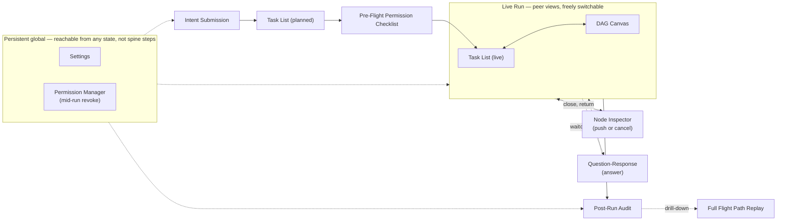

# Claude Wrapper — Experience Spine

> **Both spines (this EXPERIENCE.md and its companion DESIGN.md) win on conflict with any mock, wireframe, or import.** The 9 HTML files in `mockups/` are illustrative references that encode real decisions made in this session — they are not the source of truth if a discrepancy is ever found between a mock and what's written here.

## Foundation

Web app, Next.js, single-surface, browser-based. Claude Wrapper replaces the terminal for AI agent orchestration and hand-off — it is a companion to the IDE, not a replacement for it; the IDE remains the source of truth for the resulting files and commands. `DESIGN.md` is the visual identity reference; this file is the experience — information architecture, behavior, and state.

Single developer per run (v1) — no shared/concurrent multi-user sessions. Frontend stack: Next.js 16 + @xyflow/react (React Flow) for the canvas, per `ARCHITECTURE-SPINE.md`.

## Information Architecture

The product is a **primary linear spine** with two interrupt overlays hanging off its live step, and two persistent global entry points reachable from anywhere regardless of run state.

**Linear spine:**

1. **Intent Submission** — Dana types her plain-language intent (e.g. "add OAuth2 login with JWT"). Entry point for every run.
2. **Task List (planned)** — the Meta-Planner's output: which agents/subagents will run and what each is responsible for, before anything executes.
3. **Pre-Flight Permission checklist** — itemized file/MCP approval, per agent, before execution starts.
4. **Live Run** — **Task List (live) and DAG Canvas are peer views of the same live run, freely switchable** — neither is subordinate to the other; a user can watch a run from either surface and switch at will.
5. **Post-Run Audit** — the final summary once the run completes: expected vs. actual, changelog, cancelled-work accounting.
6. **Full Flight Path Replay** (drill-down from Post-Run Audit) — the expanded, static replay of the actual route taken through every agent's context graph.

**Two interrupt overlays**, both hanging off the live Task List/Canvas step, both **different states of the same drawer pattern family** — not the same screen:

- **Node Inspector** — `trouble` state (FR-17). Push-or-cancel decision UI.
- **Question-Response** — `waiting_input` state (FR-18). Terminal-style free-text answer; no cancel action, only a neutral Stop.

Closing either overlay returns the user to wherever they were (Task List or Canvas) — it does not force a specific landing surface.

**Two persistent global entry points**, reachable from anywhere at any time regardless of run state (per PRD UJ-2/UJ-3) — these are **not steps in the linear spine**:

- **Settings** — natural-language `.claude/` configuration (FR-1–FR-3).
- **Permission Manager (mid-run revoke view)** — add/revoke file/MCP grants at any time, including mid-run (FR-5, FR-6).

→ Composition reference: `mockups/key-intent-submission.html`, `mockups/key-task-list.html`, `mockups/key-preflight-checklist.html`, `mockups/key-dag-canvas.html`, `mockups/key-node-inspector.html`, `mockups/key-question-response.html`, `mockups/key-post-run-audit.html`, `mockups/key-flight-path-full.html`, `mockups/key-settings.html`. Spine wins on conflict.

## Voice and Tone

Plain, grounded developer-tool copy throughout every mock — no hype language, no exclamation points, no marketing tone. Warm register comes from `DESIGN.md`'s color/shape, not copy tone.

| Do | Don't |
|---|---|
| "What do you want to do?" | "Let's build something amazing!" |
| "This starts planning only — nothing executes yet." | "You're all set! Ready to go?" |
| "Finished laying out the OAuth2 module and handed off to auth_scaffold_worker." | "auth_scaffold_worker is crushing it!" |
| "waiting on your input" / "blocked until you answer" | "Uh oh, I need your help!" |
| "Not ready to answer? You can stop the agent instead." | "Don't worry, you can always cancel later 😊" |
| "trouble — needs a decision" | "Something went wrong! ⚠️" |
| "Proposal ready — not yet applied" | "Almost done! Just one more step!" |
| "Cancelled during review · yesterday" (plain, factual run history) | Celebratory or apologetic framing of cancellation |
| Short, complete, factual sentences | Icons/emoji standing in for state language |

## Component Patterns

Behavioral. Visual specs live in `DESIGN.md § Components`.

| Component | Use | Behavioral rules |
|---|---|---|
| Task-list row | Task List (planned + live) | Identity (agent name) + one-line action summary + status badge + action cluster: view-graph (jump to DAG Canvas), stop (always available on any non-terminal agent), question badge (renders only when that specific agent has an open question — FR-12). Planned state renders dashed/no-shadow; live state renders solid with a status-tinted rail. Realizes FR-12. |
| Node-inspector-family drawer | Live Task List/Canvas interrupt | Right-docked slide-over over a dimmed backdrop. Shared shell, two distinct framings: `trouble` (push-or-cancel decision UI, FR-17) and `waiting_input` (question card + free-text response + Send, no cancel action, FR-18). Both states always show a telemetry stat row (time elapsed, tokens used) and the agent's live reasoning ("thinking") trace, independent of whether a question is open. Closing returns to wherever the user was. |
| Pre-Flight checklist row | Pre-Flight Permission checklist | Grouped per agent (main orchestrator + each subagent), each file/MCP item independently checkable — not a single flattened list, not all-or-nothing. Sensitive files flagged distinctly. Execution does not begin until every item has a decision (FR-4). Synthesized (FastMCP-generated) bridges appear as their own labeled entry, distinct from pre-provided servers (FR-24). |
| Proposed-change card | Settings | Target path + category chip (one of the 8 real `target_category` values: `team_instructions` / `local_instructions` / `settings.json` / `settings.local.json` / `rule` / `skill` / `command` / `agent` — never an invented label, and never an MCP grant, which belongs to the Permission Manager, not Settings) + action badge (create/update/revoke) + plain-language summary + content preview, gated behind Approve & Apply / Reject. Nothing is written to `.claude/` until Approve & Apply is pressed (FR-2); Reject discards the proposal untouched. |
| Replay context-node annotation | Full Flight Path Replay | Same visual family as the live DAG Canvas node, explicitly reframed as "Replay": a persistent Replay badge, solid (non-pulsing) route lines, a reduced legend scoped to terminal states only (completed / trouble-then-recovered / cancelled). Token usage shown per context node and per agent (FR-20), nested consistently with the Post-Run Audit's numbers. |
| DAG Canvas connecting lines (live) | DAG Canvas | **Not** the same backend concept as "flight path" elsewhere on this table. The live canvas's agent-to-agent connector lines render the control tower's dependency/dispatch order (AD-3) — which agent releases which — not the per-agent context-node route (AD-7's constrained search, the actual "flight path" of FR-9/FR-20). The live canvas deliberately shows only agent-level boxes for glanceability; the context-node-level route only becomes visually explicit in the Replay screen, above. Do not wire the live canvas's connector lines to context-node/flight-path data — they read from dependency edges. |
| Usage & Privacy section | Settings | A third section in the Settings drawer, after "Add a rule or preference" and "Currently configured": a single opt-in toggle (off by default, per AD-4/FR-26) with one line of plain-language description of what's shared if enabled — run counts, per-agent completion/cancellation outcome, estimated-vs-actual token/time deltas only, explicitly never file contents, prompts, or reasoning text (the same allow-list AD-4 defines). When enabled, the section also shows a read-only summary of what's been sent so far (count of events, date range) — consistent with the product's stated transparency principle (FR-3's "no silent config drift" applies here too: nothing is collected before the toggle is explicitly turned on). No separate screen — lives in the existing Settings drawer alongside the other two sections. |

## State Patterns

The node status enum (Architecture spine AD-5) governs every status-bearing surface: `waiting_input | executing | trouble | completed | cancelled | failed`.

- **`trouble` is non-terminal** — recoverable via push (user provides redirect/guidance and the agent continues from its current state, no full checkpoint rollback).
- **`completed` / `cancelled` / `failed` are terminal** — a cancelled agent never resumes (FR-17); each has an entry in the Post-Run Audit, none silently omitted (FR-19).
- **`executing`** carries the live reasoning trace regardless of whether a question is also open.
- **`waiting_input`** is a normal pause, not an incident — styled with the amber status color, never the trouble orange, and carries no cancel action (only a neutral Stop, since FR-12 makes Stop always available).

**Task List has two distinct read states**, both realized by the same component (`DESIGN.md § task-list-row`):

- **Planned** — before Pre-Flight approval, dashed/no-shadow cards, no status badges yet meaningful (nothing has started).
- **Live** — during execution, solid cards with a status-tinted rail per the six-state enum above; Stop renders only on non-terminal agents ("Finished — nothing to stop" once terminal); the question badge renders only on the one agent currently blocked on input.

**Post-Run Audit / Full Flight Path Replay** treat the same six status values as **historical/final-state** markers, not live indicators — no pulse, no animation, explicit "static snapshot" framing.

## Interaction Primitives

- **view-graph** — from a Task List row, jumps to the DAG Canvas focused on that agent's node. Peer-view switch, not a navigation away from the run.
- **stop** — always available on any non-terminal agent (Task List row or drawer). Aborts the in-flight stream, terminates spawned processes, rolls back to the pre-interrupt checkpoint (FR-16).
- **push** — from the Node Inspector's `trouble` state only: provide redirect/guidance input; the agent continues from its current state without a full rollback (FR-17).
- **cancel** — from the Node Inspector's `trouble` state ("Cancel this agent") or from the Task List: terminal outcome, does not resume (FR-17). Distinct from **stop**, which targets an in-flight step generically; cancel is the explicit terminal decision for an agent in trouble.
- **answer-question** — from the Question-Response drawer's `waiting_input` state: free-text response, terminal-style, resumes the agent without a round-trip outside the UI (FR-18).
- **approve/reject-per-item** — Pre-Flight checklist: each file/MCP item decided independently, checkbox-style (FR-4). An agent whose task depends on a rejected item proceeds without that resource — no re-plan, no hard block.
- **approve-and-run** — Pre-Flight checklist's terminal action once every item has a decision: transitions the run from planned to live.
- **revoke** — Permission Manager, at any time including mid-run: cuts off every agent currently using the revoked resource immediately, same abort/cleanup path as stop (FR-5). Distinct from Pre-Flight approve/reject, which only applies before execution starts.

## Accessibility Floor

Behavioral requirements. Contrast values live in `DESIGN.md`.

- WCAG AA-ish baseline: real contrast on every text/background pairing (status text is never color-alone — it always pairs with a text label, e.g. "trouble — needs a decision", not just an orange dot).
- Keyboard navigation: every interactive control (checklist checkboxes, Approve/Reject, Push/Cancel, Send, Stop, view-graph) reachable and operable via keyboard.
- Visible `:focus-visible` states on every interactive element — textareas, buttons, checkboxes, badges that act as controls.
- No formal compliance audit for v1 — this is a working baseline, not a certified accessibility program.

## Key Flows

### UJ-1 — Dana hands off a feature and watches the plan take shape

Persona: Dana, a backend-leaning developer, tired of babysitting a single agent's raw terminal output.

1. Dana types her intent in plain language ("add OAuth2 login with JWT"). → `mockups/key-intent-submission.html`
2. The Meta-Planner determines agent/subagent count and responsibilities; the main orchestrator sequences dependent subagents rather than firing everything at once. → `mockups/key-task-list.html` (planned state)
3. For each agent, the system gathers candidate context sources and renders a graph plus a predicted token/time cost per agent. → `mockups/key-dag-canvas.html`
4. Dana reviews and approves the Pre-Flight Permission checklist (files + MCP servers each agent would touch). → `mockups/key-preflight-checklist.html`
5. Execution starts; one subagent hits `waiting_input` and asks a question inline, which Dana answers directly in the UI. → `mockups/key-task-list.html` (live state) / `mockups/key-dag-canvas.html` / `mockups/key-question-response.html`
6. Dana decides a subagent's task is unnecessary and cancels that flight — it terminates cleanly without corrupting dependent agents. → `mockups/key-node-inspector.html` (trouble/push-or-cancel state) or the Task List's Stop control.
   - **Climax:** the run completes and Dana sees the generated/changed files directly in her IDE — proof the work actually landed.
   - **Resolution:** Post-Run Audit shows, per agent, time and tokens used against the original estimate, plus the full flight path graph of the route actually taken. → `mockups/key-post-run-audit.html`, drill-down `mockups/key-flight-path-full.html`

### UJ-2 — Dana updates a project rule mid-project via Settings

Persona: Dana, mid-project, wants a standing rule enforced going forward without hand-editing `.claude/` files herself.

1. Dana opens the Settings panel (persistent global entry point — reachable regardless of run state).
2. She types a natural-language change ("always use pytest, never commit `.env` files"); the Settings Router determines which `.claude/` targets to touch and produces a plain-language summary.
3. Dana reviews the proposed-change card and approves it before anything is written — the same gating pattern as the Pre-Flight Permission checklist. → `mockups/key-settings.html`
   - **Climax:** Dana sees exactly what will change and confirms it, with no silent config drift.
   - **Resolution:** the updated `.claude/` files are in place and apply starting with the next run.

### UJ-3 — Dana revokes MCP access she no longer needs, mid-run

Persona: Dana notices an agent has access to something it shouldn't need anymore.

1. Dana opens the Permission Manager (persistent global entry point), either between runs or while a run is active.
2. She sees the itemized checklist of currently granted files/MCP servers and revokes one.
   - **Climax:** the revoke takes effect immediately — if an agent is actively mid-run using that resource, it is cut off immediately (same abort/cleanup path as Stop & Undo), not merely blocked on its next request.
   - **Resolution:** the agent's run is interrupted or continues without that resource, and all future runs respect the updated grant.

*(The Permission Manager's mid-run revoke view was confirmed in-scope as a persistent global surface during this session's IA closure, but was not one of the 9 rendered key screens — see Open Items below.)*

## Open Items

Genuinely undecided items, not resolved this session — flagged here rather than invented:

- **Keyboard shortcut set.** No keyboard-first interaction primitives (command palette, vim-style navigation, etc.) were discussed or locked this session. Every control is confirmed keyboard-*operable* (Accessibility Floor), but no shortcut vocabulary was designed.
- **Responsive / smaller-viewport behavior.** This session's mocks and decisions are scoped to a desktop browser-frame width. No breakpoint behavior for tablet/mobile viewports was discussed or decided.
- **Settings "pending / not yet applied" indicator exact color value.** The memlog and mocks describe it only qualitatively as "a muted amber-adjacent tone, distinct from any status color" — no specific hex was locked, unlike the six-color node-status palette which has full light/dark values.
- **Motion timing values.** "Purposeful, understated transitions on state change / flight-path advance" was locked as a qualitative direction; no specific duration/easing-curve values were decided this session.
- **Permission Manager mid-run-revoke screen.** Confirmed in-scope as a persistent global surface (IA closure decision) and referenced in UJ-3, but it was not one of the 9 rendered key screens this session — no visual mock exists for it yet.
