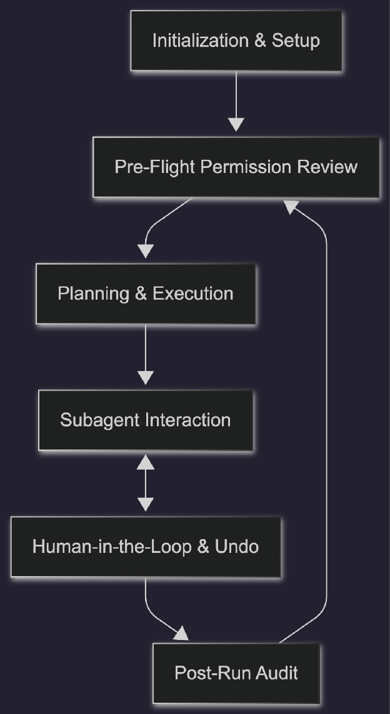

# **Claude Wrapper: System Architecture & Implementation Plan**

Building an interactive scaffolding and multi-agent execution visualizer around Claude turns dynamic orchestration into a transparent workflow. This document outlines the comprehensive plan, architecture, and feature set for the "Claude Wrapper" platform, combining the dynamic planning of autonomous AI with the safety and observability of a visual Integrated Development Environment (IDE).

## **1\. The Core Concept & User Journey**

The platform allows users to develop projects through a visual, multi-agent framework. It transforms complex autonomous orchestration into a transparent, user-controlled workflow by providing granular observability into every step of the agentic process.

## **2\. Key Platform Features**

The platform's core capabilities are designed to provide total transparency, granular observability, and interactive control throughout the multi-agent development lifecycle, ensuring that users remain at the center of the autonomous execution process. The following table details these features, their specific functionalities, and the core benefits they provide for project management and execution oversight.

| Feature | Description | Key Benefit |
| :---- | :---- | :---- |
| Settings | Parses natural language requests and maps permissions, rules, and subagent personas into a git-aware control center; provides a summary of all settings whenever opened. | Transparent configuration and setup. |
| Permission Manager | Presents itemized checklists for file and MCP server approval, allowing access to be added or revoked at any time. | Enhanced security and user control. |
| Subagent Task Management | Displays a list of tasks for the main orchestrator agent and all subagents, providing summaries of their intended actions. Includes an interactive button to show the DAG graph, a stop/human-in-the-loop control button, and an interactive question button that will only appear for subagent questions. | Clear task visibility and interactive control. |
| Execution Engine | Renders DAG (Directed Acyclic Graph) graphs detailing context gained, local files used, and MCP servers (FastMCP vs. provided). It tracks real-time flight path, monitors expected vs. actual time and token metrics for each subagent and the overall task, and displays the full flight path with token metrics upon completion. | Full observability and transparency. |
| Human-in-the-Loop & Undo | Stop & Undo Time Travel | Leverages persistent checkpoints to immediately abort in-flight LLM streams, terminate spawned FastMCP processes, and roll back the node to its pre-interrupt. Prevents wasted tokens and allows users to correct mistaken inputs seamlessly. state. |
| Question Answering | Handles subagent queries by presenting an interactive button that allows users to provide direct input to that specific agent. | Interactive troubleshooting and guidance. |
| Post-Run Audit Engine | Generates a final, comprehensive summary showing expected vs. actual time and token metrics for each subagent and the overall task. It traces the full visual flight path of the execution route through the DAG graph, highlighting token usage within each node and for all involved subagents. | Predictable resource management. |

## 

## 

## **3\. User Flow**

> * **A. Initialization & Setup:** The user configures project constraints. A dedicated Settings Router parses natural language requests and maps permissions, rules, and subagent personas directly into a git-aware .claude/ control center. Claude also provides transparency by explaining its internal settings, helping users understand the configuration and constraints.  
> * **B. Pre-Flight Permission Review:** Before execution, the system aggregates requested local files and MCP servers, presenting an itemized checklist for approval. Users have the ability to manage these settings at any time, allowing them to add or revoke access to files and MCP servers.  
> * **C. Planning & Execution:** The user submits a project intent, and the platform renders the execution path. The Meta-Planner calculates baseline complexity and expected token usage based on system prompt length, assigned workspace files, and anticipated tool round-trips. Real-time token tracking and the flight path (execution route) are visualized during execution, providing full transparency by highlighting tokens used within each node and across Claude's "thinking" process.  
> * **D. Subagent Interaction:** The UI displays a comprehensive list of tasks for the main orchestrator agent and all active subagents, including individual task summaries. Each entry includes a dedicated button to toggle its specific DAG graph, a Stop/Human-in-the-Loop (HITL) control button for manual overrides, and an interactive question-answering button that appears whenever an agent requires specific user input to proceed.  
> * **E. Human-in-the-Loop & Undo:** Execution halts gracefully on input requests from the main orchestrator or any subagent, surfacing real-time notifications. A "Stop & Undo" action allows users to instantly send an abort signal over WebSockets/SSE to cancel the active Anthropic token stream. The system then utilizes LangGraph's persistent state checkpointing to retrieve the previous checkpoint ID, rewind the thread state, and discard any intermediate scratchpad tokens generated from the mistaken input. Any ephemeral FastMCP tool processes spawned during the aborted step are gracefully terminated over stdio/SSE to prevent orphan processes.  
> * **F. Post-Run Audit & Flight Path:** After the task completes, the interface renders a visual "flight path" overlay directly on the graph that traces the actual step-by-step route the agent took. This gives the user direct visibility into the agent's reasoning and decision logic. A final summary breaks down the expected versus actual time and tokens used within each node, allowing users to evaluate context relevance, token efficiency, and prompt quality.

## **4\. Technical Architecture Diagram**

This section will contain the high-level system architecture diagram illustrating the interaction between the Frontend, Backend, and Agentic workflows.

## **5\. Frontend UI (React Flow)**

* **Dynamic Question Badges:** These visual indicators trigger specifically when a node enters the *awaiting\_input* state. This is synchronized via LangGraph interrupts and broadcast to the UI over SSE or WebSockets, alerting the user that a subagent is blocked until clarification is provided.  
* **The Input Drawer:** An interactive slide-over component that binds directly to the *live\_stream* data of the active node. It exposes Claude's real-time reasoning scratchpad alongside dedicated user input fields, allowing users to inject context or decisions directly into the agent's working memory.  
* **Subagent Resource Inspector:** Accessible via a secondary logo/icon on each node, this inspector provides a detailed breakdown of resource allocations. It visualizes the distribution of Claude context window usage, specific local workspace files, and active MCP server connections assigned to that subagent.

## **6\. Backend Orchestrator (FastAPI & LangGraph)**

* **The Brain (Meta-Planner & Settings Router):** Powered by Claude, this layer parses .claude/ configurations and translates high-level project intents into structured, estimated JSON DAG blueprints.  
* **The Engine (LangGraph State Machine):** Executes the DAG by orchestrating subagents asynchronously. It manages state persistence (via SQLite/Redis) and handles the precise pausing and resuming required for Human-in-the-Loop (HITL) interrupts.  
* **Dynamic Tools (FastMCP Synthesizer):** Identifies missing external API capabilities and generates fully compliant Model Context Protocol bridges on-the-fly, mounting them locally for isolated agent access.

### **6.1 Observability & Visual Node Schema (Backend $\rightarrow $ Frontend):**

The frontend provides real-time transparency via interactive nodes. To render the required details per subagent node, the application structures each subagent with the following unified schema:

* **config** stores system configuration like prompts and context;  
* **telemetry** tracks performance metrics such as tokens and duration;  
* **live\_stream** manages real-time status and user input requirements.

{  
  "node\_id": "auth\_scaffold\_worker",  
  "parent\_id": "backend\_planner",  
  "status": "waiting\_input",  
  "config": {  
    "system\_prompt": "You are a specialized security agent implementing OAuth2...",  
    "knowledge\_context": \["JWT RFC 7519", "FastAPI Security"\],  
    "workspace\_files": \["src/auth/jwt.py", "pyproject.toml"\],  
    "mcp\_servers": \["filesystem", "stripe\_fastmcp\_bridge"\]  
  },  
  "telemetry": {  
    "estimated\_tokens": 8500,  
    "actual\_tokens": 3410,  
    "estimated\_duration\_sec": 30,  
    "actual\_duration\_sec": 12  
  },  
  "live\_stream": {  
    "thinking": "Checking if existing cryptography dependencies are installed...",  
    "latest\_message": "Do you prefer Argon2 or Bcrypt for password hashing?",  
    "requires\_user\_input": true,  
    "interrupt\_state": {  
      "is\_interrupted": false,  
      "checkpoint\_id": null  
    }  
  }  
}

*Note: The 'status' field supports the following states: 'waiting\_input', 'executing', 'completed', and 'failed'.*

### **6.2 The Settings Router Schema (Frontend $\rightarrow $ Backend $\rightarrow $ File System):**

To intelligently parse natural language commands and categorize them into your git-aware control center, we can use a Pydantic schema to strictly format the Meta-Planner's output. This schema forces the LLM to identify the exact file target, the required action, and the specific content to write.

### **Pydantic Implementation**

from pydantic import BaseModel, Field  
from typing import Literal, List, Optional

class SettingAction(BaseModel):  
    target\_category: Literal\[  
        "team\_instructions",   
        "local\_instructions",   
        "settings.json",   
        "settings.local.json",   
        "rule",   
        "skill",   
        "command",   
        "agent"  
    \] \= Field(..., description="The specific configuration category to update.")  
      
    file\_path: Optional\[str\] \= Field(  
        None,   
        description="The exact file path to write to (e.g., '.claude/rules/code-style.md' or '.claude/agents/frontend\_agent.json')."  
    )  
      
    content: str \= Field(..., description="The formatted text, JSON, or markdown to apply.")  
      
    action: Literal\["create", "update", "revoke"\] \= Field(..., description="The file operation to perform.")

class SettingsRouterOutput(BaseModel):  
    user\_summary: str \= Field(  
        ...,   
        description="A transparent summary explaining the internal settings updates back to the user."  
    )  
      
    updates: List\[SettingAction\] \= Field(  
        ...,   
        description="The array of modifications to execute within the workspace."  
    )

### **Schema Breakdown**

* **target\_category:** Maps directly to your requested structure, allowing Claude to classify the input into commands, rules, skills, agent personas, or instructions.  
* **file\_path:** Determines exactly where the setting lives, such as placing a new modular rule in .claude/rules/ or saving team-wide approved MCP capabilities to settings.json.  
* **user\_summary:** Fulfills the requirement for Claude to provide a summary of the settings and explain its internal configuration decisions to the user.  
* **action:** Gives the user the ability to manage settings at any time, such as manually revoking a previously granted "Always Allow" permission for a local file.

## **7\. Technology Stack & Tools**

The technology stack is engineered to support robust scalability, ensuring the system can handle complex multi-agent workflows while maintaining real-time observability and total developer transparency throughout the execution lifecycle.

| Category | Description | Resources Needed |
| :---- | :---- | :---- |
| Frontend UI | Next.js (React) paired with React Flow (or xyflow) for visualizing the DAG agent trees, node states, and real-time token telemetry. | Node.js, React Flow dependencies |
| Orchestration Backend | Python utilizing FastAPI and LangGraph (with Prefect as an alternative) to manage the asynchronous state machines, checkpointer persistence, and human-in-the-loop (HITL) interrupts. | Python runtime, FastAPI, LangGraph/Prefect |
| Tool Integration | FastMCP and Pydantic for rapid, on-the-fly wrapping of external APIs into fully compliant Model Context Protocol tools. Dynamically generated servers connect to the AI client via stdio (for local, ephemeral processes) or SSE (for remote microservices). | FastMCP library, API credentials |
| Telemetry & State Management | SQLite or Redis for LangGraph state persistence, paired with Server-Sent Events (SSE) or WebSockets to stream live execution metrics and Claude's scratchpad reasoning to the UI. | SQLite/Redis storage, WebSocket/SSE infrastructure |

## **8\. Development Roadmap**

> 1. **Phase 1: Core Engine:** Set up FastAPI \+ LangGraph state engine with token streaming and checkpoint-based HITL interrupts. Initialize the .claude/ state manager and build the FastAPI Meta-Planner endpoint returning DAG schemas and token estimates.  
> 2. **Phase 2: FastMCP Bridge:** Build the prompt and execution pipeline that takes an API URL/spec, writes a FastMCP script using type hints, and launches it over stdio. Note: Developers can interactively test and debug these generated tools prior to execution using the built-in MCP Inspector by running uv run mcp dev server.py or fastmcp dev server.py.  
> 3. **Phase 3: Visual Canvas:** Implement Next.js \+ React Flow to render nodes, subagent branches, and live telemetry badges.  
> 4. **Phase 4: Node Inspector:** Create slide-over drawers showing Claude's live thinking scratchpad, MCP resources, files used, and prompt forms for paused agents.  
> 5. **Phase 5: Post-Run Audit:** Build the run-summary view showing delta metrics (Estimated vs. Actual tokens/time) and a changelog of generated files.
